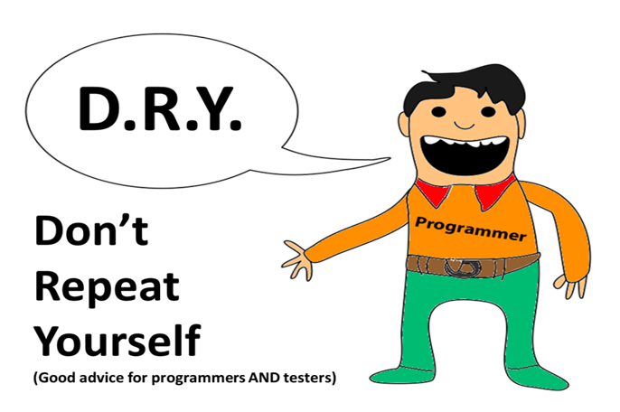

#Покрасьте абзацы по клику (событие [click](https://www.w3schools.com/Jsref/tryit.asp?filename=tryjsref_element_addeventlistener)):
##даны 3 абзаца:
```html
<p id="text1">Text 1</p>
<p id="text2">Text 2</p>
<p id="text3">Text 3</p>
```
##дан массив цветов:
```javascript
const colors = ['magenta', 'cyan', 'firebrick', 'springgreen', 'skyblue'];
```
- по первому нажатию на абзац он должен покраситься в первый цвет из массива, по второму нажатию - во второй и так далее;
- цвета из массива меняются бесконечно;
- все абзацы работают независимо.

